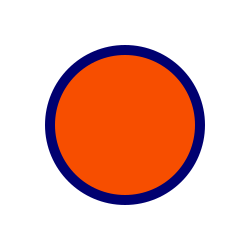
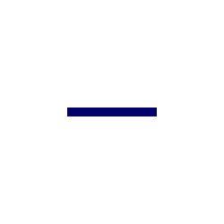
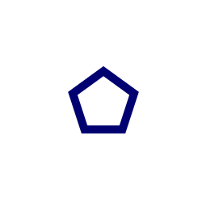
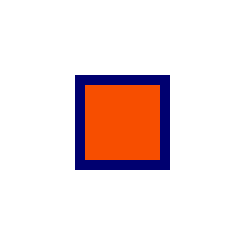
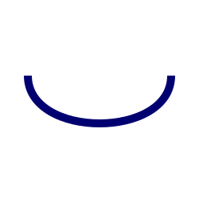
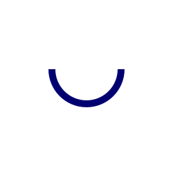
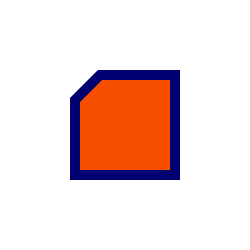
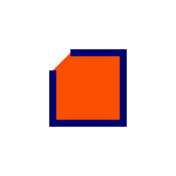
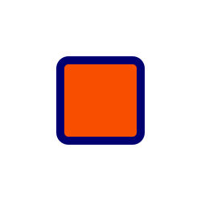
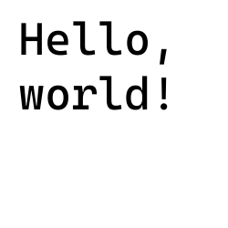

# Pocket Sized Facade.js

> 💫 A functional, pocket sized version of Facade.js

[](https://github.com/neogeek/pocket-sized-facade.js/actions/workflows/test.workflow.yml)
[](https://www.npmjs.org/package/pocket-sized-facade.js)

## Install

```bash
$ npm install pocket-sized-facade.js
```

```html
<script
  type="module"
  src="https://unpkg.com/pocket-sized-facade.js/index.js"
></script>
<script type="module">
  import { clearCanvas } from 'https://unpkg.com/pocket-sized-facade.js/index.js';

  const canvas = document.querySelector('canvas');
  const context = canvas.getContext('2d');
</script>
```

## API

### `resizeForHDPI(context, ratio)`

```javascript
import { resizeForHDPI } from 'https://unpkg.com/pocket-sized-facade.js/index.js';

const canvas = document.querySelector('canvas');
const context = canvas.getContext('2d');

resizeForHDPI(context, 2);
```

### `clearCanvas(context)`

```javascript
import { clearCanvas } from 'https://unpkg.com/pocket-sized-facade.js/index.js';

const canvas = document.querySelector('canvas');
const context = canvas.getContext('2d');

clearCanvas(context);
```

### `drawCircle(context, x, y, radius, options)`



```javascript
import { drawCircle } from 'https://unpkg.com/pocket-sized-facade.js/index.js';

const canvas = document.querySelector('canvas');
const context = canvas.getContext('2d');

drawCircle(context, 125, 125, 75, {
  fillStyle: '#F74E00',
  lineWidth: 10,
  strokeStyle: '#000070',
});
```

### `drawImage(context, x, y, image, width, height, options)`


```javascript
import { drawImage } from 'https://unpkg.com/pocket-sized-facade.js/index.js';

const canvas = document.querySelector('canvas');
const context = canvas.getContext('2d');

const image = document.createElement('img');

image.setAttribute(
  'src',
  'https://duckduckgo.com/assets/logo_homepage.normal.v108.svg'
);

const draw = () => {
  if (image.complete) {
    drawImage(context, image, 10, 10);
  }

  requestAnimationFrame(draw);
};

requestAnimationFrame(draw);
```

### `drawLine(context, x, y, x1, y1, x2, y2, options)`



```javascript
import { drawLine } from 'https://unpkg.com/pocket-sized-facade.js/index.js';

const canvas = document.querySelector('canvas');
const context = canvas.getContext('2d');

drawLine(context, 75, 125, 0, 0, 100, 0, {
  lineWidth: 10,
  strokeStyle: '#000070',
});
```

### `drawPath(context, d, options)`



```javascript
import { drawPath } from 'https://unpkg.com/pocket-sized-facade.js/index.js';

const canvas = document.querySelector('canvas');
const context = canvas.getContext('2d');

drawPath(
  context,
  'M128,88.0901699 L165.956504,115.667184 L151.45841,160.287731 L104.54159,160.287731 L90.0434961,115.667184 L128,88.0901699 Z',
  {
    lineWidth: 10,
    strokeStyle: '#f00',
  }
);
```

### `drawPolygon(context, x, y, points, closed, options)`





```javascript
import { drawPolygon } from 'https://unpkg.com/pocket-sized-facade.js/index.js';

const canvas = document.querySelector('canvas');
const context = canvas.getContext('2d');

drawPolygon(
  context,
  75,
  75,
  [
    [5, 5],
    [90, 5],
    [90, 90],
    [5, 90],
  ],
  true,
  {
    fillStyle: '#F74E00',
    lineWidth: 10,
    strokeStyle: '#000070',
  }
);
```

### `drawPolyline(context, points, closed, options)`




```javascript
import { drawPolyline } from 'https://unpkg.com/pocket-sized-facade.js/index.js';

const canvas = document.querySelector('canvas');
const context = canvas.getContext('2d');

drawPolyline(context, '100 75 175 75 175 175 75 175 75 100', false, {
  fillStyle: '#F74E00',
  lineWidth: 10,
  strokeStyle: '#000070',
});
```

### `drawRect(context, x, y, width, height, radius, options)`



```javascript
import { drawRect } from 'https://unpkg.com/pocket-sized-facade.js/index.js';

const canvas = document.querySelector('canvas');
const context = canvas.getContext('2d');

drawRect(context, 75, 75, 100, 100, 10, {
  fillStyle: '#F74E00',
  lineWidth: 10,
  strokeStyle: '#000070',
});
```

### `drawText(context, x, y, text, options)`



```javascript
import { drawText } from 'https://unpkg.com/pocket-sized-facade.js/index.js';

const canvas = document.querySelector('canvas');
const context = canvas.getContext('2d');

drawText(context, 20, 60, 'Hello, world!', {
  fillStyle: '#000',
  font: 'italic 50px Courier New',
});
```
